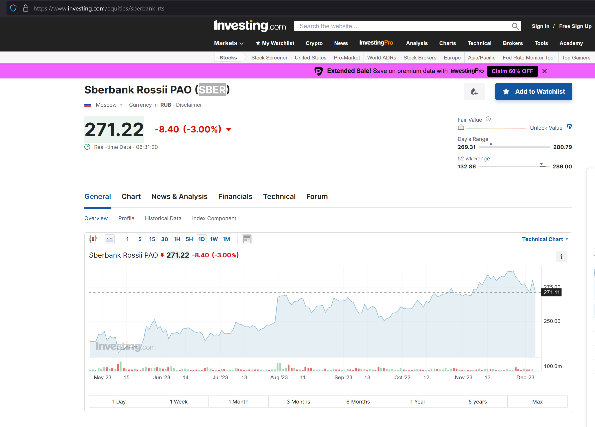
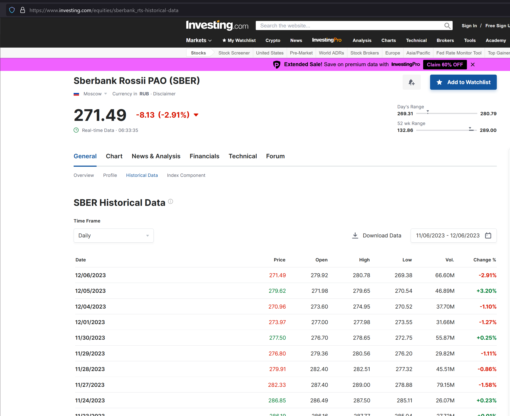

# stock_predication

Проект для предсказания цены акции на ближайшие 15 дней.
В качестве данных используется датасет с сайта investing.com.

## Как скачать необходимый датасет?


На примере акции SBER.

Предворительно зарегистрируйтесь на сайте. https://www.investing.com. 

Далее:

- Откройте страницу https://www.investing.com/equities/sberbank_rts


#### Перейдите в разде Historical Data 

#### Скачайте необходимый датасет и поместите его в директорию ./app/content

#### Исправьте в юпитер ноутбуке Stock_predication_RF_investing.ipynb путь к файлу, например:

```

    historical_prices = preparation(pd.read_csv("./app/content/SBER.csv"))

```
Запустите юпитер ноутбук Stock_predication_RF_investing.ipynb

